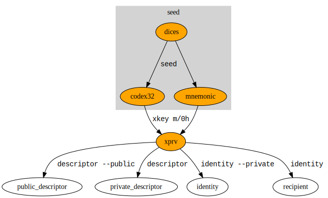

# Dinasty

Dinasty is a command line tool for creating an inheritable bitcoin wallet.
See available [`Commands`](crate::Commands#variants).

Dinasty is not a wallet, it uses bitcoin core wallet.

Dinasty is meant to be used in a offline/online scenario, where:
- the online wallet is watch only, without secret keys, generates 
  [PSBT](https://bitcoinops.org/en/topics/psbt/) to be signed offline
- the offline wallet has secret keys and can sign prepared PSBT

Dinasty standard flows doesn't include an hardware wallet, but a generic purpose device always 
offline.

The heir doesn't know anything about the wallet until it's time.

Anything secret is passed via standard input/output, this is useful because:
- could avoid leaking secrets via command history or file system
- allows composability, for example you can encrypt/decrypt secret data with your existing GPG setup,
 like the following pseudpscript:
    - `dinasty seed | gpg --encrypt >/my-secret`
    - `gpg --decrypt /my-secret | dinasty sign`

You can do inheritance in bitcoin with various techniques, dinasty choose presigned locktimed 
transactions. 
In simple terms your wallet creates presigned transactions moving funds to the heir wallet, but
those transactions are accepted by the bitcoin network only in the future, for example in 4 years. 
Before the 4 years expiration, the owner could respend the funds and repeat the process, kicking in 
the future the possible move of the funds. 

In the dinasty flow those transactions are encrypted and periodically delivered to the heir, for 
example via email or usb key.

The decryption key is given to one ore more trusted party with the instruction to give those to the
heir in case something happen.

Obviously a collusion between the trusted thir party and the heir could allow them to decrypt the
transactions and have a look at the wallet balance, but they cannot spend anyway if the locktime is
still active.

## Other inheritance techniques

 - using CSV has been considered but the refresh time is too little, it would be required to refresh
 UTXO at most once a year which is considered too frequent.
 - using multisg shared by owner and other trusted parties, but this doesn't fulfill well the 
 requirement that only the owner knows about the wallet.

## How to read test examples

Test examples like [`Seed`](crate::Commands#variant.Seed) are made to look like shell commands, but they are actually rust code.
The reason for that is that they are executed with the test suite so that they are never wrong
or outdated.
In the test we use a rust variable `stdin` which represent the standard input of the shell command.
The shell command is the second parameter of the rust function `sh()`

Line starting with `#` [are not comments](https://doc.rust-lang.org/rustdoc/write-documentation/documentation-tests.html#hiding-portions-of-the-example) 
but actual executed code. They are used to hide the elements in rendered documentation, to focus on
the important lines.

The shell command may contains {variable}, those are replaced with the value of the respective `variable`

## Setup Example

Use 2 offline devices A and B and another online devices M

Needed executables: `bitcoind`, `gpg`, `dinasty`, `pass`, `age` 

M) `PASSWORD_STORE_CHARACTER_SET=1234567890qwertyuiopasdfghjklzxcvbnm pass generate machine/A/gpg-passphrase 24`

M) `PASSWORD_STORE_CHARACTER_SET=1234567890qwertyuiopasdfghjklzxcvbnm pass generate machine/B/gpg-passphrase 24`

M) `gpg --export <gpg-id> | base32`  # armor is not suitable for barcode reading, base32 is slightly more efficient in QR code and doesn't contain character that are mapped differently in different keyboard layout

A,B) import gpg public key of M DEADBEEM

A) `gpg --full-generate-key` use machine/A/gpg-passphrase -> eg DEADBEE1

B) `gpg --full-generate-key` use machine/B/gpg-passphrase -> eg DEADBEE2

A,B) `alias decrypt='gpg --decrypt'`

A) `alias encrypt='gpg --encrypt -r DEADBEE1' | base32`

B) `alias encrypt='gpg --encrypt -r DEADBEE2' | base32`

A,B) `alias encrypt_to_online='gpg --encrypt DEADBEEM' | base32`
`alias qr=dinasty qr`

A,B) `dinasty seed` with the value from examples and check result match

A) `dinasty seed --codex32-id leet | encrypt >seed` piped to encrypted data, actual launch dices, terminated with return and ctrl-d

A) `cat seed | decrypt` put passphrase, will be requested once per session, `killall gpg-agent` to remove it from memory

B) `cat - | encrypt >seed` input MANUALLY the seed from machine A so that the seed is saved in the other machine too (`cat -` waits stdin, when you finish type hit return than ctrl-D )

A,B) `decrypt owner_key | dinasty descriptor --account 0 | encrypt >owner_descriptor`  both machine could have signer wallet 

A,B) `decrypt owner_descriptor | shasum -a 256` take note of descriptor hash, ensure they are the same on A,B

A) `decrypt owner_key | dinasty descriptor --public --account 0 | encrypt >owner_descriptor_public` 

A) `decrypt heir_key | dinasty descriptor --account 1 | encrypt >heir_descriptor` 

A) `decrypt heir_key | dinasty descriptor --public --account 1 | encrypt >heir_descriptor_public` 

A) `decrypt owner_descriptor_public && decrypt heir_descriptor_public`  bring to M

M) `cat owner_descriptor_public | dinasty import --wallet-name watch_only`

M) `bitcoin-cli getnewaddress` take note of the first address F

A,B) `decrypt owner_descriptor | dinasty import --wallet-name signer`

A,B) `bitcoin-cli getnewaddress` ensure they are the same and equal to F

A) `decrypt heir_descriptor | encrypt_to_online >heir_descriptor_encrypted_to_online` bring to M

A,B) `decrypt heir_key | dinasty identity --private | encrypt heir_identity`  write down on multiple sheets, give to trusted parties 

A,B) `decrypt heir_key | dinasty identity  | encrypt heir_identity_public`

A,B) check age derive private to same public

A,B) `alias encrypt_to_heir='age --encrypt -r ${cat heir_identity_public}'`

## Heir descriptor (once)

A or B) `decrypt heir_descriptor | encrypt heir_identity | base32 | dinasty qr` bring to M

M) scan QR in a text file "qrs". `cat qrs | tr -d '\n' | base 32 --decode > heir_descriptor_encrypted`

## Locktime

To be done whenever UTXO in owner wallet are created, for example for a change in a spending or a refresh to eliminate near-to-expire locktimes.

M) `dinasty locktime -w watch_only --locktime-future 200000 --to-public-descriptor ${cat heir_descriptor_external_public} | tee >(shasum -a 256 1>&2) | base32 | dinasty qr` bring to A, take note hash H_locktime

A) scan QR in a text file "qrs". `cat qrs | tr -d '\n' | base32 --decode | tee >(shasum -a 256 1>&2) | cat > locktime_to_be_signed` check same H_locktime

A) `decrypt owner_descriptor | dinasty sign -w signer --psbt-file locktime_to_be_signed | encrypt_to_heir | tee >(shasum -a 256 1>&2) | base32 | dinasty qr` bring back to M, take not hash H_signed_locktime

M) scan QR in a text file "qrs". `cat qrs | tr -d '\n' | base32 --decode | tee >(shasum -a 256 1>&2) | cat > locktime_signed_encrypted` check same  H_signed_locktime
