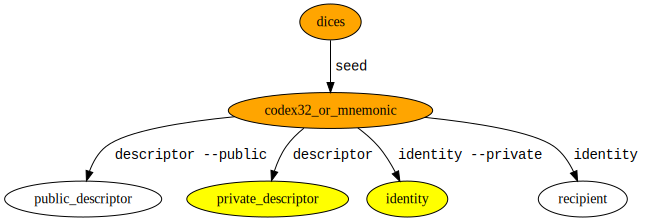

# Dinasty

Dinasty is a command line tool for creating an inheritable bitcoin wallet.
See available [`Commands`](crate::Commands#variants).

Dinasty is not a wallet, it uses bitcoin core wallet.

Dinasty is meant to be used in a offline/online scenario, where:
- the online wallet is watch only, without secret keys, generates 
  [PSBT](https://bitcoinops.org/en/topics/psbt/) to be signed offline
- the offline wallet has secret keys and can sign prepared PSBT

Dinasty standard flows doesn't include an hardware wallet, but a generic purpose device always 
offline.

The heir doesn't know anything about the wallet until it's time.

Anything secret is passed via standard input/output, this is useful because:
- could avoid leaking secrets via command history or file system
- allows composability, for example you can encrypt/decrypt secret data with your existing GPG setup,
 like the following pseudpscript:
    - `dinasty seed | gpg --encrypt >/my-secret`
    - `gpg --decrypt /my-secret | dinasty sign`

You can do inheritance in bitcoin with various techniques, dinasty choose presigned locktimed 
transactions. 
In simple terms your wallet creates presigned transactions moving funds to the heir wallet, but
those transactions are accepted by the bitcoin network only in the future, for example in 4 years. 
Before the 4 years expiration, the owner could respend the funds and repeat the process, kicking in 
the future the possible move of the funds. 

In the dinasty flow those transactions are encrypted and periodically delivered to the heir, for 
example via email or usb key.

The decryption key is given to one ore more trusted party with the instruction to give those to the
heir in case something happen.

Obviously a collusion between the trusted thir party and the heir could allow them to decrypt the
transactions and have a look at the wallet balance, but they cannot spend anyway if the locktime is
still active.

## Other inheritance techniques

 - using CSV has been considered but the refresh time is too little, it would be required to refresh
 UTXO at most once a year which is considered too frequent.
 - using multisg shared by owner and other trusted parties, but this doesn't fulfill well the 
 requirement that only the owner knows about the wallet.

## How to read test examples

Test examples like [`Seed`](crate::Commands#variant.Seed) are made to look like shell commands, but they are actually rust code.
The reason for that is that they are executed with the test suite so that they are never wrong
or outdated.
In the test we use a rust variable `stdin` which represent the standard input of the shell command.
The shell command is the second parameter of the rust function `sh()`

Line starting with `#` [are not comments](https://doc.rust-lang.org/rustdoc/write-documentation/documentation-tests.html#hiding-portions-of-the-example) 
but actual executed code. They are used to hide the elements in rendered documentation, to focus on
the important lines.

The shell command may contains {variable}, those are replaced with the value of the respective `variable`

  // TODO embed_doc image?
